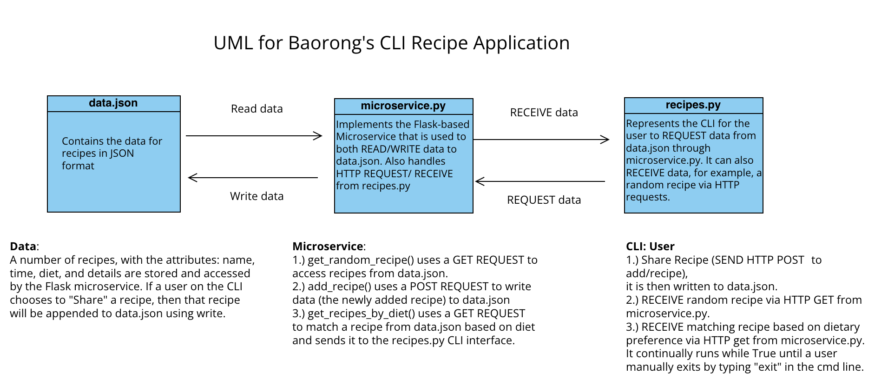

# CS361 Communication Contract for Partner's Microservice (Assignment 9):
### Christian McKinnon and Baorong Luo
### Professor Letaw
(All code relating to my partner's Microservice for CS361 will be pushed to this repository).

# Communication Contract:

1. Clear instructions for how to programmatically REQUEST data from the microservice you implemented. Include an example call:

The file structure of Baorong’s Recipe application is as follows: we first have a Project directory that contains 4 Python files and 1 JSON file, they are: recipes.py, microservice.py, tester.py, and data.json. The first Python file, recipes.py, is an adaptation of Baorong’s implementation as theirs directly interacted with data.json to facilitate the functionality of their application. In this updated version, recipes.py now requests data through the Flask microservice, microservice.py, to request random recipes or recipes that match a user’s dietary preferences.

To successfully REQUEST recipe information from data.json through the Microservice, microservice.py must already be running in a separate terminal, such that the Flask microservice is running on http://127.0.0.1:5000. Once it is running, either the CLI (recipes.py) or the tester file (tester.py) can be run to interact with the Microservice.

An example REQUEST call can be found within tester.py recipes_by_diet_tester() method:
It calls the Microservice using requests.get(), based on the selected diet, and assigns it to the variable response.

Attempt to match a user's dietary preference with a recipe from data.json:
```python
def recipes_by_diet_tester():
    diet = 'V'
    response = requests.get(f'{FLASK_URL}/recipes_by_diet/{diet}')
    if response.status_code == 200:
        print(f"Recipes for diet '{diet}':")
        print(response.json())
    else:
        print(f"Error occurred when matching '{diet}' diet, please try again!")
```

2. Clear instructions for how to programmatically RECEIVE data from the microservice you implemented:

Similar to the approach outlined above, the Microservice, microservice.py, must already be running in a separate terminal, such that the Flask server is running on http://127.0.0.1:5000 in order to RECEIVE data.

An example RECEIVE call can also be found within the recipes_by_diet_tester() method. This occurs in the code in two steps:

    1. A request for data must first be made:
```python 
    response = requests.get(f'{FLASK_URL}/recipes_by_diet/{diet}')
```

    2. A response from the Microservice will be returned with data in response.json():
```python
    print(response.json())
```
    This now comprises the random recipe that has been generated, and prints it to the console.


# UML for recipes.py:
Found at: 